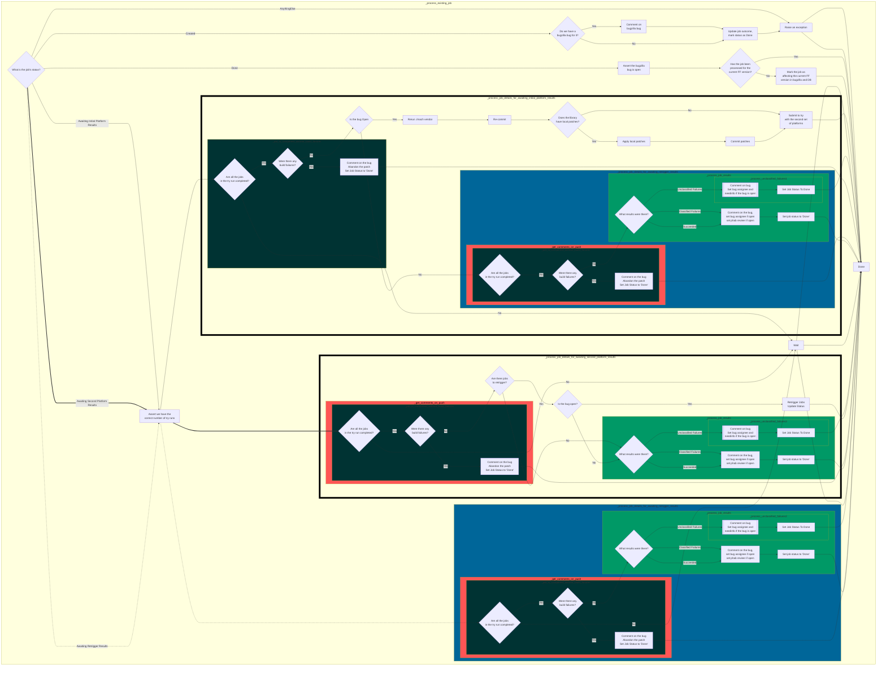

```mermaid
graph TD
    subgraph _process_existing_job
    Done[Done]
    RaiseException[Raise an exception]
    Wait

    classDef c_process_job_results fill:#096;
    classDef c_process_unclassified_failures fill:#096;

    classDef c_process_job_details_for_awaiting_retrigger_results fill:#069;
    classDef c_get_comments_on_push fill:#F55, color:#000;
    classDef c_job_is_completed_without_build_failures fill:#033;

    classDef c_process_job_details_for_awaiting_second_platform_results stroke-width:10px,stroke:#000;
    classDef c_process_job_details_for_awaiting_initial_platform_results stroke-width:10px,stroke:#000;
    

    A{What is the job's status?}
    A --> |Created|HandleCreated
    A --> |Done|AssertOpen
    A ------> |Awaiting Initial Platform Results|AssertCorrectNumberOfTryRun
    A ==> |Awaiting Second Platform Results|AssertCorrectNumberOfTryRun
    A -.-> |Awaiting Retrigger Results|AssertCorrectNumberOfTryRun
    A --> |AnythingElse|RaiseException --> Done

    HandleCreated{Do we have a <br />bugzilla bug for it?} 
    HandleCreated --> |Yes|C[Comment on </br>bugzilla bug] --> HandleCreatedError
    HandleCreated --> |No|HandleCreatedError
    
    HandleCreatedError[Update job outcome, <br />mark status as Done] --> RaiseException --> Done

    AssertOpen[Assert the bugzilla<br />bug is open]
    AssertOpen --> CheckFFVersion

    CheckFFVersion{Has the job been <br />processed for the<br /> current FF version?}
    CheckFFVersion --> |Yes|Done
    CheckFFVersion --> |No|MarkAffected[Mark the job as<br />affecting the current FF<br />version in bugzilla and DB] --> Done

    AssertCorrectNumberOfTryRun[Assert we have the<br /> correct number of try runs]
    AssertCorrectNumberOfTryRun -->JobsAllDone1
    AssertCorrectNumberOfTryRun -.-> JobsAllDone22
    AssertCorrectNumberOfTryRun ==>JobsAllDone33

    
    %% ====================================================================================================================
    subgraph _process_job_details_for_awaiting_initial_platform_results1[_process_job_details_for_awaiting_initial_platform_results]
        subgraph _job_is_completed_without_build_failures1[_job_is_completed_without_build_failures]
            
            JobsAllDone1{Are all the jobs <br />in the try run completed?}
            JobsAllDone1 --> |Yes|AnyBuildFailures1
            class JobsAllDone1 jobsCompleted;
            
            
            AnyBuildFailures1{Were there any <br />build failures?}
            AnyBuildFailures1 --> |Yes|HandlebuildFailures1
            class AnyBuildFailures1 buildFailures;

            HandlebuildFailures1[Comment on the bug<br />Abandon the patch<br />Set Job Status to 'Done']
        end
        class _job_is_completed_without_build_failures1 c_job_is_completed_without_build_failures;
        
        AnyBuildFailures1 --> |No|BugOpen1

        BugOpen1{Is the bug Open}
        BugOpen1 --> |No|JobsAllDone11
        BugOpen1 --> |Yes|ReVendor

        ReVendor[Rerun ./mach vendor] --> ReCommit
        ReCommit[Re-commit] -->HasPatches
        
        HasPatches{Does the library <br />have local patches?}
        HasPatches --> |No|SubmitToTry
        HasPatches --> |Yes|Y1[Apply local patches] --> Y2[Commit patches] --> SubmitToTry

        SubmitToTry[Submit to try <br />with the second set <br />of platforms]

        subgraph _process_job_details_for_awaiting_retrigger_results1[_process_job_details_for_awaiting_retrigger_results]
            subgraph _get_comments_on_push1[_get_comments_on_push]
                subgraph _job_is_completed_without_build_failures11[_job_is_completed_without_build_failures]
                    JobsAllDone11{Are all the jobs <br />in the try run completed?}
                    JobsAllDone11 --> |Yes|AnyBuildFailures11
                    
                    AnyBuildFailures11{Were there any <br />build failures?}
                    AnyBuildFailures11 --> |Yes|HandlebuildFailures11
                    
                    HandlebuildFailures11[Comment on the bug<br />Abandon the patch<br />Set Job Status to 'Done']
                end
                class _job_is_completed_without_build_failures11 c_job_is_completed_without_build_failures;
            end
            class _get_comments_on_push1 c_get_comments_on_push;
            AnyBuildFailures11 -->|No| WhatTypeOfResults11
            subgraph _process_job_results1[_process_job_results]
                WhatTypeOfResults11{What results were there?}
                
                WhatTypeOfResults11 --> |Unclassified Failures|_process_unclassified_failures11
                subgraph _process_unclassified_failures1
                    _process_unclassified_failures11[[Comment on bug <br />Set bug assignee and <br />needinfo if the bug is open]] --> X111[Set Job Status To Done]
                end
                class _process_unclassified_failures1 c_process_unclassified_failures;

                WhatTypeOfResults11 --> |Classified Failures|_process_no_unclassified_failures
                _process_no_unclassified_failures[Comment on the bug,<br /> set bug assignee if open<br />set phab revieer if open] --> _set_to_done

                WhatTypeOfResults11 --> |Succeeded|_process_no_unclassified_failures
                
                _set_to_done[Set job status to 'Done']
            end
            class _process_job_results1 c_process_job_results;
        end
        class _process_job_details_for_awaiting_retrigger_results1 c_process_job_details_for_awaiting_retrigger_results;
    end
    class _process_job_details_for_awaiting_initial_platform_results1 c_process_job_details_for_awaiting_initial_platform_results;
    SubmitToTry --> Done
    X111 --> Done

    JobsAllDone1 --> |No|Wait --> Done
    HandlebuildFailures1 --> Done
    HandlebuildFailures11 --> Done
    _set_to_done --> Done

    %% ====================================================================================================================
    subgraph _process_job_details_for_awaiting_second_platform_results3[_process_job_details_for_awaiting_second_platform_results]
        subgraph _get_comments_on_push3[_get_comments_on_push]
            subgraph _job_is_completed_without_build_failures33[_job_is_completed_without_build_failures]
                JobsAllDone33{Are all the jobs <br />in the try run completed?}
                JobsAllDone33 --> |Yes|AnyBuildFailures33
                
                AnyBuildFailures33{Were there any <br />build failures?}
                AnyBuildFailures33 --> |Yes|HandlebuildFailures33
                
                HandlebuildFailures33[Comment on the bug<br />Abandon the patch<br />Set Job Status to 'Done']
            end
            class _job_is_completed_without_build_failures33 c_job_is_completed_without_build_failures;
        end
        class _get_comments_on_push3 c_get_comments_on_push;

        AnyBuildFailures33 -->|No| ShouldRetrigger33

        ShouldRetrigger33{Are there jobs<br/> to retrigger?}
        ShouldRetrigger33 --> |Yes|IsBugOpen33
        ShouldRetrigger33 --> |No|WhatTypeOfResults33

        IsBugOpen33{Is the bug open?}
        IsBugOpen33 --> |Yes|RetriggerJobs33
        IsBugOpen33 --> |No|WhatTypeOfResults33

        RetriggerJobs33[Retrigger Jobs<br />Update Status]

        subgraph _process_job_results3[_process_job_results]
            WhatTypeOfResults33{What results were there?}
            
            WhatTypeOfResults33 --> |Unclassified Failures|_process_unclassified_failures33
            subgraph _process_unclassified_failures3
                _process_unclassified_failures33[[Comment on bug <br />Set bug assignee and <br />needinfo if the bug is open]] --> X333[Set Job Status To Done]
            end
            class _process_unclassified_failures3 c_process_unclassified_failures;

            WhatTypeOfResults33 --> |Classified Failures|_process_no_unclassified_failures3
            _process_no_unclassified_failures3[Comment on the bug,<br /> set bug assignee if open<br />set phab revieer if open] --> _set_to_done3

            WhatTypeOfResults33 --> |Succeeded|_process_no_unclassified_failures3
                
            _set_to_done3[Set job status to 'Done']
        end
        class _process_job_results3 c_process_job_results;
    end
    class _process_job_details_for_awaiting_second_platform_results3 c_process_job_details_for_awaiting_second_platform_results;
    JobsAllDone33 --> |No|Wait --> Done
    X333 --> Done
    RetriggerJobs33 --> Done
    HandlebuildFailures33 --> Done
    _set_to_done3 --> Done

    %% ====================================================================================================================
    subgraph _process_job_details_for_awaiting_retrigger_results2[_process_job_details_for_awaiting_retrigger_results]
        subgraph _get_comments_on_push2[_get_comments_on_push]
            subgraph _job_is_completed_without_build_failures22[_job_is_completed_without_build_failures]
                JobsAllDone22{Are all the jobs <br />in the try run completed?}
                JobsAllDone22 --> |Yes|AnyBuildFailures22
                
                AnyBuildFailures22{Were there any <br />build failures?}
                AnyBuildFailures22 --> |Yes|HandlebuildFailures22
                
                HandlebuildFailures22[Comment on the bug<br />Abandon the patch<br />Set Job Status to 'Done']
            end
            class _job_is_completed_without_build_failures22 c_job_is_completed_without_build_failures;
        end
        class _get_comments_on_push2 c_get_comments_on_push;

        AnyBuildFailures22 -->|No| WhatTypeOfResults22
        subgraph _process_job_results2[_process_job_results]
            WhatTypeOfResults22{What results were there?}
            
            WhatTypeOfResults22 --> |Unclassified Failures|_process_unclassified_failures22
            subgraph _process_unclassified_failures2
                _process_unclassified_failures22[[Comment on bug <br />Set bug assignee and <br />needinfo if the bug is open]] --> X222[Set Job Status To Done]
            end
            class _process_unclassified_failures2 c_process_unclassified_failures;

            WhatTypeOfResults22 --> |Classified Failures|_process_no_unclassified_failures2
            _process_no_unclassified_failures2[Comment on the bug,<br /> set bug assignee if open<br />set phab revieer if open] --> _set_to_done2

            WhatTypeOfResults22 --> |Succeeded|_process_no_unclassified_failures2
                
            _set_to_done2[Set job status to 'Done']
        end
        class _process_job_results2 c_process_job_results;
    end
    class _process_job_details_for_awaiting_retrigger_results2 c_process_job_details_for_awaiting_retrigger_results;
    X222 --> Done

    JobsAllDone22 --> |No|Wait --> Done
    HandlebuildFailures22 --> Done
    _set_to_done2 --> Done
    end
```