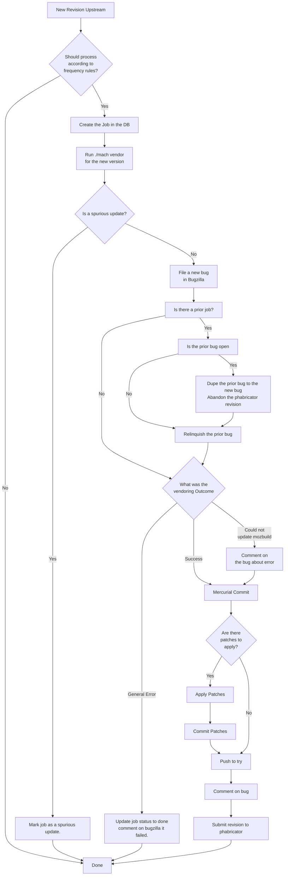

```mermaid
graph TD
    Done[Done]

    A[New Revision Upstream]
    A --> FrequencyCheck
    
    FrequencyCheck{Should process <br />according to <br/>frequency rules?}
    FrequencyCheck -->|Yes| CreateJob
    FrequencyCheck -->|No| Done

    CreateJob[Create the Job in the DB]
    CreateJob --> VendorTheNewVersion

    VendorTheNewVersion[Run ./mach vendor <br/>for the new version]
    VendorTheNewVersion --> SpuriousCheck
    
    SpuriousCheck{Is a spurious update?}
    SpuriousCheck -->|No| FileBug
    SpuriousCheck -->|Yes| X1[Mark job as a spurious update.] --> Done

    FileBug[File a new bug<br />in Bugzilla]
    FileBug --> PriorBug

    PriorBug[Is there a prior job?]
    PriorBug -->|Yes| IsPriorBugOpen
    PriorBug --> |No| HandleVendoringOutcomes

    IsPriorBugOpen[Is the prior bug open] 
    IsPriorBugOpen --> |Yes| HandleOpenPriorBug
    IsPriorBugOpen --> |No| RelinquishPriorBug

    RelinquishPriorBug[Relinquish the prior bug]

    HandleOpenPriorBug[Dupe the prior bug to the new bug<br />Abandon the phabricator revision]
    HandleOpenPriorBug --> RelinquishPriorBug

    RelinquishPriorBug --> HandleVendoringOutcomes

    HandleVendoringOutcomes{What was the<br />vendoring Outcome}
    HandleVendoringOutcomes --> |General Error| X2[Update job status to done<br />comment on bugzilla it failed.] --> Done
    HandleVendoringOutcomes --> |Could not <br />update mozbuild| CommentMozBuild
    HandleVendoringOutcomes --> |Success| Commit

    CommentMozBuild[Comment on<br />the bug about error] --> Commit

    Commit[Mercurial Commit] -->HasPatches

    HasPatches{Are there <br />patches to <br />apply?}
    HasPatches --> |Yes| ApplyPatches[Apply Patches] --> CommitPatches[Commit Patches] --> PushToTry
    HasPatches --> |No| PushToTry

    PushToTry[Push to try]
    PushToTry --> CommentOnBug

    CommentOnBug[Comment on bug]
    CommentOnBug --> SubmitPhab

    SubmitPhab[Submit revision to phabricator]
    SubmitPhab --> Done
```